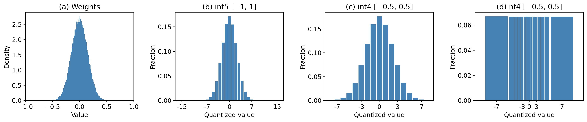

# Record: SP8192 + GPTQ Embeddings + Depth Recurrence + MuonEq-R + SDClip + Simplifications — val_bpb 1.08563

**val bpb: 1.08563** (5-seed mean, std=0.0007)

| Seed | Steps | Pre-quant BPB | Post-quant BPB | **Sliding BPB** | Artifact |
|-|-|-|-|-|-|
| 1    | 4988  | 1.08996 | 1.10239 | **1.08554** | 15,987,547 |
| 42   | 4986  | 1.08994 | 1.10345 | **1.08664** | 15,988,983 |
| 1234 | 4989  | 1.08942 | 1.10130 | **1.08463** | 15,983,318 |
| 1337 | 4992  | 1.09079 | 1.10222 | **1.08554** | 15,984,924 |
| 2025 | 4989  | 1.09092 | 1.10239 | **1.08578** | 15,983,617 |
| **Mean** | | 1.09021 | 1.10235 | **1.08563** | 15,985,678 |

## Changes

This script builds on [#1218](https://github.com/openai/parameter-golf/pull/1218). The main changes are:
* Increase the vocabulary size from 4096 to 8192.
* GPTQ-quantize the embedding matrix instead of using simple round-to-nearest quantization. The other matrices were already using GPTQ.
* Remove the value embeddings.
* Replace the coprime-stride data loader from [#726](https://github.com/openai/parameter-golf/pull/726) with a simpler ShuffledSequenceLoader.
* Loop layers 4-5 twice (while sharing params): the idea is from [#1204](https://github.com/openai/parameter-golf/pull/1204), but this script uses a simpler implementation and loops twice rather than once.
* Use row-normalized Muon from [#1217](https://github.com/openai/parameter-golf/pull/1217).
* Choose the quantization clip threshold based on the standard deviation of the row rather than searching for a quantile with low reconstruction error. See the note at the end for motivation/details.

## Requirements

Flash Attention 3 (Hopper) is required. The script imports `flash_attn_interface` directly and was run with PyTorch 2.11.0+cu130. Install commands:

```bash
pip install torch --index-url https://download.pytorch.org/whl/cu130
pip install --no-cache-dir \
  "https://download.pytorch.org/whl/cu130/flash_attn_3-3.0.0-cp39-abi3-manylinux_2_28_x86_64.whl"
pip install -r requirements.txt
```

The tokenizer and pre-tokenized data (sp8192) is available on my [HuggingFace](https://huggingface.co/datasets/kevclark/parameter-golf). You can download it with:

```bash
rm -f data/manifest.json
MATCHED_FINEWEB_REPO_ID=kevclark/parameter-golf \
python3 data/cached_challenge_fineweb.py --variant sp8192 --train-shards 128
```

Note this first deletes any existing `data/manifest.json` because the download script caches the manifest locally, and a stale one from the default repo won't include sp8192. Alternatively, to regenerate the tokenizer and dataset from scratch:

```bash
cat > data/tokenizer_specs_8192.json << 'EOF'
[
  {
    "name": "sp_bpe_8192",
    "kind": "sentencepiece_bpe",
    "vocab_size": 8192,
    "tokenizer_train_docs": 5000000
  }
]
EOF
python3 data/download_hf_docs_and_tokenize.py \
  --output-root data \
  --tokenizer-config data/tokenizer_specs_8192.json \
  --skip-byte
```

## Run Command

```bash
RUN_ID=1337 SEED=1337 \
torchrun --standalone --nproc_per_node=8 train_gpt.py
```

## Quantization–Compression Tradeoffs

Quantization and compression interact in interesting ways. The compressed size depends not just on bitwidth, but also on the clip range (also called the scale) used during quantization. An int5 quantized network can actually compress smaller than an int4 one if the int5 quantization uses a much wider clip range. The reason is that the effectiveness of compression algorithms like `brotli` depends on the entropy of the data they are compressing, and increasing the clip range can lower that entropy.

### An example



Neural network weights are approximately normally distributed (a). In this example, we could clip the weights to [-1, 1] and uniformly quantize them into int5 (b). But this seems a bit wasteful because many of those bins are spent modeling the tails of the distribution, where very few weights lie. Instead, we could clip to [-0.5, 0.5] and use int4 \(c). Or we could go one step further and use a non-uniform quantizer such as [NF4](https://arxiv.org/abs/2305.14314) (d) so there are approximately the same number of weights at each quantized value.

Now here is the surprising part: after compression, int4 is only slightly smaller than int5, and NF4 is quite a bit larger. Why? Because the effectiveness of compression depends on not just the raw number of bits, but also the entropy of the quantized values. When we moved from int5 to int4, we made the histogram flatter, which increases entropy. NF4 flattens it even further by design, pushing the entropy higher still.

Another view is that the int4 and int5 parameters are mostly the same. The only difference is that the weights that would have been clipped to +-7 by int4 can take on larger values in int5, but as there are very few of them, this does not substantially increase compressed size.

### Mathematical explanation

Suppose our network has $n$ weights and we quantize each one to $b$ bits. The quantized model size is $s_q = n b$. However, we also compress our network after quantizing. A useful first approximation is that the compressed size $s$ is proportional to $H(q)$, the entropy of the quantized weights:

$$s \propto H(q)$$

This is not exact: compressors can also exploit structure beyond the marginal distribution. But neural network weights usually contain much less structure than natural data, so in practice their compressed size is often very close to what their entropy would suggest. So what is $H(q)$? Suppose our weights are normally distributed:

$$w \sim  \mathcal{N}(0, \sigma^2)$$

The differential entropy is

$$H(w) = \frac{1}{2}\log{2\pi e} + \log{\sigma}$$

Now, suppose we clip our weights between $[-c, c]$ and quantize them into $2^b$ evenly spaced bins, i.e, we uniformly quantize them into int-$b$. Each bin then has width

$$l = \frac{2c}{2^b} = \frac{c}{2^{b-1}}.$$

The entropy of the resulting quantized weights, which we call $q$, is approximately

$$
\begin{aligned}
H(q) &\approx H(w) - \log l \\
&= H(w) - \log(c / 2^{b-1}) \\
&= \frac{1}{2}\log(2\pi e) + \log \sigma - \log c + \log(2^{b-1})
\end{aligned}
$$

If we measure entropy in bits, this becomes

$$H(q) \approx  \frac{1}{2}\log_2{\frac{\pi e}{2}} + \log_2{\frac{\sigma}{c}} + b$$

This approximation becomes more accurate when $c \gg  \sigma$ (since in that case only a small fraction of the weights are clipped), when $b$ is large enough that the quantization bins are small, and when $n$ is large enough that we still have many weights per bin.

A natural choice is to set the clip range proportional to the standard deviation, writing $c = k\sigma$ for some hyperparameter $k$. This makes the amount of clipping scale-invariant: if the weights become 2x larger, the clip range should also become 2x larger. Substituting $c = k\sigma$ into the expression above gives

$$
\begin{aligned}
H(q) &\approx \frac{1}{2}\log_2(\frac{\pi e}{2}) + \log_2(\frac{\sigma}{k\sigma}) + b \\
&= b - \log_2 k + \text{constant}
\end{aligned}
$$

This gives two ways to reduce compressed model size: decrease $b$ (for example, go from int5 to int4), or increase $k$ (use a wider clip range so the quantized values get more concentrated near the center, which lowers their entropy). In fact, increasing $b$ and increasing $k$ have roughly opposite effects. The histogram produced by $(b, k)$ exactly matches the middle $2^b$ bins of $(b + 1, 2k)$. The $(b + 1, 2k)$ quantization also includes additional outer bins, but very few weights lie in those bins, so $H(q)$ may not increase by much. This is exactly what we saw in the int5 versus int4 example.

Of course our approximations do not hold exactly in practice: the derivation ignores clipping, the weight distribution is only approximately normal, and compression depends on the full byte representation, not just the marginal histogram of quantized values. However, when I examined some trained networks, I found the standard deviation of a matrix (an estimate of $\sigma$) correlated very strongly ($R^2=0.995$) with the compression ratio of that matrix under a fixed clip width, suggesting the approximations are reasonable in practice. Lastly, I should note that usually each row is quantized separately, but the same reasoning applies on a per-row basis.

### Improved clipping

The previous practice was to search over multiple clip thresholds to find the one that minimized reconstruction error. In the new version, the clipping threshold for a matrix row is just set at

$$c=k \cdot  \text{std}(\text{row})$$

In practice, I used $b = 6, k = 12.85$ for matrix parameters (tuned so the artifact is close to 16MB) and $b=8, k = 20$ for embeddings (they are more sensitive to quantization). As the above analysis suggests, upping the matrix params to int7 or int8 while doubling/quadrupling $k$ produced similarly-sized models, but I stuck with int6 to keep the script consistent with the previous version. Compared with the old approach, the new standard-deviation-based clipping has several advantages:
-  **More principled:** It directly accounts for compressed size, not just reconstruction error. In the old approach, changes to the script could unexpectedly change the final compressed size because they changed the best clip threshold.
-  **Faster:** We only need to run GPTQ once per matrix, rather than once for every candidate clip threshold.
-  **Easier to tune:** Increasing $k$ monotonically reduces the compressed size, making it easier to control how close the model is to the 16MB cap.
